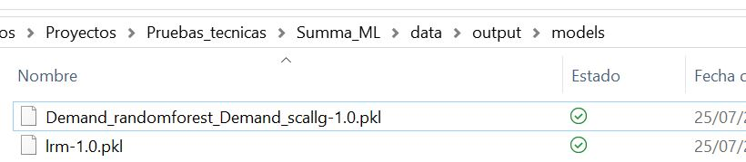

# Desarrollo prueba técnica Profesional Machine Learning - SUMMA
[](https://python.org)
[](https://fastapi.tiangolo.com/)
[](https://www.docker.com)

Este Repo **Summa_ML** es el desarrollo de la prueba técnica para **Profesional Machine Learning -SUMMA**
En este se desarrollaron los ejercicios practicos:
   
1. [Regresión: Pronóstico de la demanda](#regresión-pronóstico-de-la-demanda)
2. [Clasificación: Predicción de la clase](#clasificacion_predicción-de-la-clase)
3. [API](#API)
4. [Completar to_predict](#completar-to_predict)
5. [Docker](#docker)
6. [Teoría](#teoría)

## Introducción al Repo
#### Clona el repositorio:
   ```bash
   git clone https://github.com/alejomd17/Summa_ML.git
  ```
#### Instala las dependencias:
   ```bash
   pip install -r requirements.txt
   ```
#### Explora el Repo


   ```bash
 # Carpeta code
Se encuentran alojados los scripts con los que se dio solución a los ejercicios
* El jupyter summa_ml_full.ipynb resuelve los ejercicios de Regresión, Clasificación y Completar to_predict, este jupyter hace las veces de un Orchestrator que va utilizando diferentes modulos, que se encuentran en la carpeta src
* El script api_class_compras.py construye la API usando FastApi
```


   ```bash
 # Carpeta data
Se encuentran alojados los inputs y los outputs
* En la carpeta inputs, están los archivos iniciales brindados por Summa
* En la carpeta outputs, están las soluciones de los ejercicios, consta de tres carpetas:
** plots: donde queda alojada la gráfica de la predicción
** models: donde quedan alojados los modelos versionados ganadores de la predicción y la clasificación
** results: donde quedan alojados los archivos (excel) que dan respuesta de la predicción, clasificación y las métricas con las que se ganó en cada una, así cómo un archivo auxiliar para la clasificación, se explicará más adelante
   ```



   ```bash
 # Carpeta devops
Se encuentran alojado el dockerfile y su respectiva app, para despliegue
   ```


## Desarrollo de la prueba
## 1. Regresión: Pronóstico de la demanda
El desarrollo de este ejercicio se desarrolla en el script de jupyter [summa_ml_full](./code/summa_ml_full.ipynb) dentro de la carpeta [code](./code)\
Cuenta también con los modulos dentro de la carpeta [code/src](./code/src)


En este, se busca encontrar un pronóstico sobre la demanda para los períodos 2022-05, 2022-06 y 2022-07.
Exporta los modulos y librerías creadas en [code/src](./code/src)
   ```bash
# Librerías
# =================
import os
import pandas as pd

import warnings;
warnings.simplefilter('ignore')

# Modulos
# =================
from src.parameters import Parameters
from src.pred_preprocessing import clean_atipicis, scalated_dataframe
from src.pred_predictions import fn_prediction, plot_pred
   ```
Se realiza la lectura del archivo input [dataset_demand_acumulate.csv](./data/input/dataset_demand_acumulate.csv)
   ```bash
# Datos
# =================
df_demanda   = pd.read_csv(os.path.join(Parameters.input_path, 'dataset_demand_acumulate.csv'))
   ```
Y se establecen parametros que son puestos a disposición en [parameters.py](./code/src/parameters.py)
   ```bash
# Parametros
# =================
steps                   = Parameters.steps   -----> 4 Pasos, que es el tiempo con el que se hará el testeo para encontrar el mejor modelo
col_pronos              = Parameters.col_pronos---> str: Columna Demand
col_y                   = Parameters.col_y--------> str: Columna yearmonth
scales                  = Parameters.scales-------> 4 escalas: Normal, [0,1], [-1,1] y logaritmica
   ```
Una vez establecido todo esto, se procede a ejecutar.
#### 1. Limpieza de datos
Los datos comienzan a ser limpiados, utilizando la función *clean_data* de [pred_preprocessing](./code/src/pred_preprocessing.py)
Esta función, evalúa la serie de tiempo recibida y determina que valores fueron atípicos según la diferencia entre la media y 2 veces la desviación estandar, y crea las columnas atipics (1 si es atípico, 0 si no), la columna Demand_with_atipics (que es la original) y renueva la columna Demand (en la que los datos que son atípicos, se interpola para eliminar los atipicos. Esta última, será la columna que se utilizará para el resto del ejercicio.
   ```bash
df_clean_atipics = clean_atipicis(df_demanda, col_pronos, col_y)
   ```
#### 2. Escalamiento de los datos
Se escalan los datos, es decir, se transforman según cada una de las escalas establecidas anteriormente (scales), utilizando la función *scalated_dataframe* de [pred_preprocessing](./code/src/pred_preprocessing.py)
Esto se crea con el fin de evaluar cada una de las posibles escalamiento de los datos para comparar entre ellas y elegir la que mejor respuesta otorgue.
   ```bash
df_standarized   = scalated_dataframe(df_clean_atipics, col_pronos)
   ```
#### 3. Predicción
El dataframe creado con todas las escalas se pasa por la función *fn_prediction* de [pred_predictions](./code/src/pred_predictions.py)
Esta función crea los dataframes de train y de test y evalúa cada una de los datos escalados.
   ```bash
df_pred = fn_prediction(df_standarized, steps, scales,col_pronos, col_y)
   ```
Los dataframe de train, test, escalados, así como los steps, col_pronos y scale son evaluados en la función *evaluate_models* de [pred_competition](./code/src/pred_competition.py)
En esta función, se pasan los argumentos mencionados por diferentes modelos, que están contemplados en el modulo [pred_models](./code/src/pred_models.py)
Para los cuales, devuelve tanto el modelo construído, como la predicción usando el df_test.

   ```bash
Los modelos utilizados son:
* Lasso
* Sarima
* Random Forest
* XGBoost
   ```
Cada uno de estos modelos se construyen sus métricas y los resultados son almacenados en 3 diccionarios, uno para los modelos (dict_models), uno para las metricas (dict_model) y otro para las predicciones (dict_pred)

Se itera y se agrupa por cada una de las escalas y finalmente se hace una competencia de modelos para elegir entre todos los modelos el que mejor métricas tenga, lo cuál generará los mejores pronosticos posibles. Esta competencia se lleva con la función *model_competition* de [pred_competition](./code/src/pred_competition.py) en donde se elige los resultados que tengan al menos 2 de 3 de las mejores métricas.

   ```bash
Las métricas utilizados son:
* RMSE
* MAPE
* R2
   ```
Esas métricas y pronósticos se almacenan en los resultados, en el archivo [winner_metrics_pred.xlsx](./data/output/results/winner_metrics_pred.xlsx)


Y el modelo ganador, que luego será el que se utilizará para los nuevos pronósticos se guarda como modelo versionado en la carpeta de modelos, para el ejercicio el ganador fue un modelo Sarima con los datos escalados logaritmicamente [Demand_sarima_Demand_scallg](./data/output/models/Demand_sarima_Demand_scallg-1.0.pkl)


Finalmente, ya con el modelo ganador obtenido, podremos realizar el pronóstico de los nuevos meses, utilizando el modelo ganador, y en caso de requerirlo, los resultados se "reescalan", es decir, se escalan inversamente para volver a tener los datos según su nominal original. Utilizamos la función *de_escalate* de [pred_preprocessing](./code/src/pred_preprocessing.py)

#### 4. Visualización y guardado de los resultados
Obtenido el df_pred, lo ilustraremos según los requerimientos del ejercicio.
Esto se realiza usando *plot_pred* de [pred_predictions](./code/src/pred_predictions.py)
   ```bash
plot_pred(df_demanda, df_pred, col_pronos, col_y)
   ```
En este, se crea un dataframe en donde se almacena la data real, los pronósticos del testeo y los resultados de la predicción, así cómo una fecha de corrida y el nombre de la variable, el cuál es el resultado final [df_plot.xlsx](./data/output/results/df_plot.xlsx)


Y por último, se crea una visualización que se almacena en [pred_Demand.png](./data/output/plots/pred_Demand.png)


## 2. Clasificación: Predicción de la clase
El desarrollo de este ejercicio también se desarrolla en el script de jupyter [summa_ml_full](./code/summa_ml_full.ipynb) dentro de la carpeta [code](./code)\
Cuenta también con los modulos dentro de la carpeta [code/src](./code/src)


En este, se busca encontrar un pronóstico sobre la demanda para los períodos 2022-05, 2022-06 y 2022-07.
Exporta los modulos y librerías creadas en [code/src](./code/src)
   ```bash
# Librerías
# =================
import os
import pandas as pd

import warnings;
warnings.simplefilter('ignore')

# Modulos
# =================
from src.parameters import Parameters
from src.class_preprocessing import data_to_class
from src.class_classification import train_classification, fn_classification
   ```
Se realiza la lectura del archivo input [dataset_alpha_betha.csv](./data/input/dataset_alpha_betha.csv)
   ```bash
# Datos
# =================
df_variables    = pd.read_csv(os.path.join(Parameters.input_path, 'dataset_alpha_betha.csv'))
   ```
Una vez establecido todo esto, se procede a ejecutar.
#### 1. Entrenamiento
Se dispone a entrenar el modelo que clasifique, según sus caracteristicas, si una compra es [Alpha, Betha].
Primero, debemos obtener cuales son las variables predictoras(X) y predichas (y). Utilizamos entonces la función *data_to_class* de [class_preprocessing](./code/src/class_preprocessing.py)
   ```bash
X, y            = data_to_class(df_variables, train = True)
   ```
En este, se hace la limpieza, transformación de las caracteristicas para tener un dataset mas homogeneo y poder convertir las variables a categoricas, según sea el caso.
Una vez obtenidos todos y cada uno de los posibles variables dummies que podamos, vamos a guardar un archivo auxiliar que nos ayudará cuando el desarrollo este en productivo en la API y en el Docker. Este archivo es [df_col_dummies.xlsx](./data/output/results/df_col_dummies.xlsx)

Cuando obtenemos la X, y, podemos realizar el entrenamiento para obtener el modelo con la función *train_classification* de [class_classification](./code/src/class_classification.py)
   ```bash
train_classification(X, y)
   ```
En esta función se particionan los dataframes en X_train, X_test, y_train, y_test y se evalúan en la función *evaluate_models_classification* de [class_competition](./code/src/class_competition.py)
Similar a como se hizo con la predicción se evalúan varios modelos, que generan ciertas métricas y pronósticos que se almacenan en los diccionarios respectivos (dict_models, dict_pred, dict_metrics)

   ```bash
Los modelos utilizados son:
* Logistic Regression
* Logistic Regression Multivariable
* KNeighbors
* DecisionTree
* SVC  Vectores de soporte
* Random Forest
* Gaussian NB

Las métricas utilizados son:
* Precision
* Recall
* f1-score
   ```
Luego, se hace la competencia de modelos para elegir entre todos los modelos el que mejor métricas tenga, lo cuál generará los mejores pronosticos posibles. Esta competencia se realiza con la función *class_competition* de [class_competition](./code/src/class_competition.py) en donde se elige los resultados que tengan al menos 2 de 3 de las mejores métricas.

Esas métricas y pronósticos ganadores se almacenan en los resultados, en el archivo [winner_metrics_class.xlsx](./data/output/results/winner_metrics_class.xlsx)


Y el modelo ganador, que luego será el que se utilizará para los nuevos pronósticos se guarda como modelo versionado en la carpeta de modelos, para el ejercicio el ganador fue un modelo Sarima con los datos escalados logaritmicamente [lrm](./data/output/models/lrm-1.0.pkl)


#### 2. Solución con to_predict
> [!NOTE]
> Acá se soluciona el ejercicio 4 de completar el to_predict

Con el modelo entrenado, podemos hacer la predicción con los datos de [to_predict.csv](./data/input/to_predict.csv)
Utilizamos también como soporte las columnas dummies mencionadas anteriormente y llenamos con los datos pronosticados en demandas del ejercicio 1 los datos de la demanda.
Construimos los X, y. y finalmente hacemos el pronóstico usando la función *fn_classification* del modulo [class_classification](./code/src/class_classification.py) 

   ```bash
df_to_pred                            = pd.read_csv(os.path.join(Parameters.input_path, 'to_predict.csv'))
df_pred_demand                        = pd.read_excel(os.path.join(Parameters.results_path, 'df_plot.xlsx'))
df_to_pred['Demand']                  = df_pred_demand[['year_month','pred']][-3:]['pred'].values
X, y                                  = data_to_class(df_to_pred)
df_class, df_class_consolidate        = fn_classification(df_to_pred, X)
   ```
Con esta última función, el dataframe se organiza para que quede con las mismas variables dummies originales y buscamos el último modelo ganador versionado con el cuál hacemos el pronóstico de los datos de [to_predict.csv](./data/input/to_predict.csv)
Estos resultados se almacenan en un dataframe junto con la fecha de corrida, el cuál es el resultado final y se guarda en [df_class.xlsx](./data/output/results/df_class.xlsx)


## API
Aqui
## Completar to_predict
y
## Docker
sib
## Teoría
### 1. 
En la empresa GA, en el área de compras necesitan CLASIFICAR y organizar los correos que llegan a la bandeja de entrada entre 4 tipos de correos (Compras cementos, Compras energía, Compras concretos y correos generales o de otra índole). Esta tarea se le encomienda a usted, como es el Gestor SR en temas de analítica e IA puede solicitar al área interesada los recursos humanos que necesite para llevar a cabo este proyecto, también puede solicitar en tecnología todo lo que necesite, además tiene las bandejas de entrada de correos históricos de los analistas que reciben estas solicitudes con aproximadamente: 5500 correos de compras cementos, 2700 correos de compras de energía, 1100 correos de compras concretos y 12876 correos generales o de otra índole.
Explique como resolvería este problema, metodología, algoritmos, modelos, arquitectura del proyecto etc.
   ```bash
En principio este es ejercicio de minería de textos o de procesamiento de lenguaje natural, donde el conocimiento se adquiere adoptando bases de datos de textos. Varios estudios previos plantean que este tipo de estudio con los correos electrónico podrían estudiarse desde dos enfoques:
Una es la categorización de texto por machine learning empleando modelos de clasificación como KNN, Naive Bayesiano Supervisado o vectores de soporte SVM y random forest, arboles de decisión e incluso, redes neuronales.  
La otra es la coincidencia de patrones de texto y planillas. Una forma es la creación de un diccionario con palabras que tienen posibilidad de aparecer en determinado correo y se categorizan. Otra forma, y de manera más reciente, hay modelos basados en Deep learning que implementen una red neuronal basada en modelo lstm para clasificar correos.
Entonces, la forma de trabajo sería, un etiquetado manual de correos, una exploración y comparación de correos (plantillas) y formas que puedan llegar, preprocesamiento de la data, pruebas de machine learning para construcción de un clasificador automático con alguno de los modelos mencionados anteriormente. 
La propuesta metodológica y su arquitectura de una manera muy general, está planteado de la siguiente forma:
1.	Se debe recoger la data, como son archivos de correo, esto se debe almacenar en HTML, y se deberían retirar las etiquetas para quedar solo con contenido textual.
2.	Preprocesamiento, limpieza de datos, transformación, reducción de la dimensionalidad
3.	Aprendizaje, Python usando modelos SVM, XGboost, etc. De ser muy grande la data, se sugeriría usar spark.
4.	Evaluación y selección del modelo
5.	Ejecución
6.	La arquitectura, hay varios elementos, primero se debe tener guardada la información en un espacio, como un datalake, databricks y un ftp.
Desconozco la forma, pero posiblemente se pueda llevar a cabo en azure, puntualmente en ML Ops, También se podría agruparlo en un Docker para llevarlo a despliegue en una appp, web, o front 
   ```
### 2.
Seis meses después de haber desplegado un modelo de regresión en producción, los usuarios se dan cuenta que las predicciones que este está dando no son tan acertadas, se le encarga a usted como Gestor SR en temas de IA que revise que puede estar sucediendo.
¿Cree que el modelo esté sufriendo Drift?
¿Cómo puede validarlo?
¿De ser así, que haría usted para corregir esto?
Explique sus respuestas.
  ```bash
Si, el modelo puede estar perdiendo predicción dado que esta dejando de lado los eventos y situaciones que vienen ocurriendo en los últimos 6 meses que afectan el comportamiento de la predicción, por tanto, es importante tener un tiempo de reentramiento más corto para que estos efectos no sigan ocurriendo. La forma de evidenciar si está o no perdiendo efectividad es calculando las predicciones versus la realidad y calcular el valor de algunas métricas de acierto de predicción como el MAPE, el RMSE o el R2, y compararlas con las que dieron en la última puesta en producción en su entrenamiento, si es evidente su caída, podemos asumir que el modelo perdió asertividad.
Como lo mencioné anteriormente, una de las formas de asegurar que esto no ocurra, es reentrenando los modelos con menor tiempo, para así posibilitar que los modelos aprendan lo que sucedió recientemente y calculen un pronóstico mucho más semejante a la realidad, puesto que es probable que ocurriesen eventos de datos atípicos, tendencias, estaciones o incluso situaciones geopolíticas.
Si es muy difícil poder lograr que se reentrene por los altos costos, se debería hacer una especie de alerta que muestre el nivel de acierto que va teniendo semana a semana y poder haciendo ajustes que no requieran modelación (por ejemplo, la suma de datos atípicos, etc).
   ```
### 3.
3.	Su equipo de trabajo está trabajando en un chatbot con generación de texto utilizando el modelo GPT-3.5, según cómo funciona este modelo, ¿cómo haría usted para hacer que las respuestas del chatbot estén siempre relacionadas a conseguir cierta información particular del usuario y no empiece a generar texto aleatorio sobre cualquier tema? 
Explique su respuesta.
  ```bash
Le preguntaré a ChatGPT
   ```